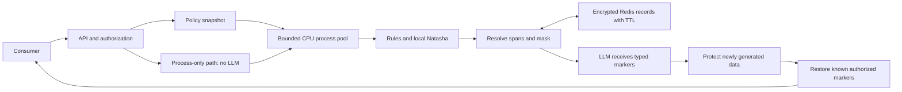

# Architecture

The organizer endpoint has two directions determined by keyed fingerprints of
request content, never by invocation count. Redis atomically chooses the winning
record for concurrent first requests. Layout masks need exact input identity;
typed tokens can be restored after the LLM rearranges surrounding text.

AES-GCM uses a fresh nonce per encrypted record and a scoped state key as
associated data. State keys and content fingerprints are HMAC-derived. Full
original text is not stored as an additional copy; the encrypted record contains
the masked text plus the original selected fragments and policy snapshot.

One API process owns one bounded worker pool. Every worker loads model weights
once. Async HTTP/Redis I/O stays on the event loop. A timed-out CPU future retains
its capacity slot until actual completion; overload returns 429 rather than
growing an unbounded queue. Input size, response size, Redis memory, and worker
capacity are bounded. Loss of a required component fails closed.

Mask rendering costs O(n + k log k) for n characters and k selected intervals;
memory includes the request, output, and k replacements. Rule scanning is bounded
per block; NER compute is measured rather than assigned a fictitious constant.
Overlap resolution depends on candidate density and can have quadratic work in
a pathological overlapping group. Optimize it only after a measured bottleneck.

