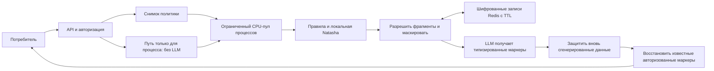

# Архитектура

Конечная точка организатора имеет два направления, определяемых ключевыми
отпечатками содержимого запроса, никогда — числом вызовов. Redis атомарно
выбирает выигрышную запись для конкурентных первых запросов. Layout-маски
требуют точной идентичности ввода; типизированные токены можно восстановить
после того, как LLM переставит окружающий текст.

AES-GCM использует свежий nonce для каждой шифрованной записи и ограниченный
ключ состояния как ассоциированные данные. Ключи состояния и отпечатки
содержимого выводятся через HMAC. Полный исходный текст не хранится как
дополнительная копия; шифрованная запись содержит замаскированный текст плюс
исходные выбранные фрагменты и снимок политики.

Один процесс API владеет одним ограниченным пулом воркеров. Каждый воркер
загружает веса модели один раз. Асинхронный HTTP/Redis I/O остаётся на цикле
событий. Истёкший по таймауту CPU-future сохраняет свой слот ёмкости до
фактического завершения; перегрузка возвращает 429, а не растёт в неограниченную
очередь. Размер ввода, размер ответа, память Redis и ёмкость воркеров ограничены.
Потеря обязательного компонента приводит к fail-closed.

Рендеринг маска стоит O(n + k log k) для n символов и k выбранных интервалов;
память включает запрос, вывод и k замен. Сканирование правил ограничено на блок;
вычисления NER измеряются, а не получают вымышленную константу. Разрешение
пересечений зависит от плотности кандидатов и может иметь квадратичную работу в
патологической группе пересечений. Оптимизируйте его только после измеренного
узкого места.